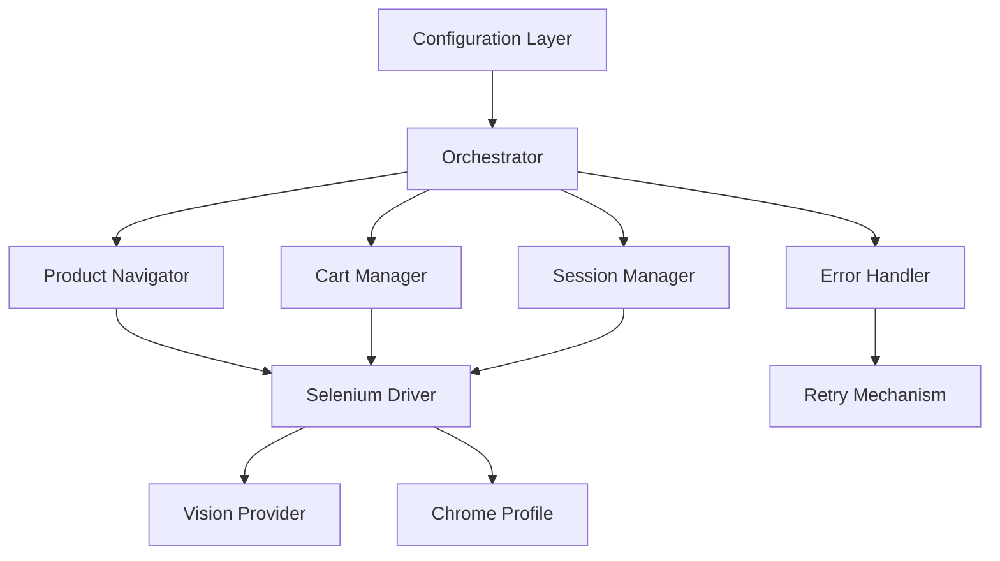
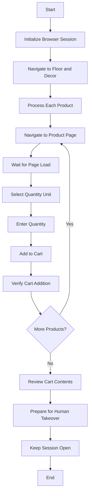

# Floor and Decor Automation Script Design Document

## Executive Summary

This document outlines the design for an automation script that will add specific tile products to the cart on Floor and Decor's website. The solution leverages the existing Selenium-based infrastructure with vision-guided automation capabilities, Chrome profile support, and robust error handling mechanisms.

## 1. Architecture Overview

### 1.1 System Architecture



### 1.2 Core Components

1. **Orchestrator**: Main controller that coordinates all operations
2. **Product Navigator**: Handles navigation to product pages and product interactions
3. **Cart Manager**: Manages cart operations (add, verify, review)
4. **Session Manager**: Handles browser session lifecycle and handover
5. **Configuration Layer**: Manages product lists and settings
6. **Error Handler**: Provides robust error handling and recovery

### 1.3 Integration with Existing Infrastructure

The solution will leverage:

- **SeleniumCanvasDriver**: For browser automation and element interaction
- **VisionWebAgent**: For vision-guided element identification and clicking
- **Chrome Profile Support**: For maintaining authenticated sessions
- **Vision Providers**: OpenAI/Z.ai for intelligent element detection

## 2. Product Data Structure

### 2.1 Product Definition

```python
@dataclass
class TileProduct:
    sku: str
    name: str
    quantity: int
    unit_type: str  # "pieces" or "boxes"
    category: str  # URL category path
    url_pattern: str  # Full URL pattern
    coverage_area: Optional[float] = None  # sq ft coverage
    notes: Optional[str] = None
```

### 2.2 Product Configuration

```python
@dataclass
class ProductList:
    name: str
    products: List[TileProduct]
    store_location: Optional[str] = None
    contingency_percentage: float = 0.1  # 10% default
```

### 2.3 Specific Product List

```python
FLOOR_DECOR_PRODUCTS = ProductList(
    name="Floor and Decor Tile Order",
    products=[
        TileProduct(
            sku="100507714",
            name="La Belle Air Ceramic Polished Tile, Blue 3x12",
            quantity=400,
            unit_type="pieces",
            category="shower-tile",
            url_pattern="https://www.flooranddecor.com/shower-tile/la-belle-air-ceramic-polished-tile-100507714.html"
        ),
        TileProduct(
            sku="101055184",
            name="Hawkins Ivory Porcelain Tile, 12x24",
            quantity=3,
            unit_type="boxes",
            category="porcelain-tile",
            url_pattern="https://www.flooranddecor.com/porcelain-tile/hawkins-ivory-porcelain-tile-101055184.html"
        ),
        TileProduct(
            sku="101068724",
            name="Blue Celeste Thassos Bianco Carrara Fan Honed Marble Mosaic, 12x12",
            quantity=3,
            unit_type="pieces",
            category="marble-decoratives",
            url_pattern="https://www.flooranddecor.com/marble-decoratives/blue-celeste-thassos-bianco-carrara-fan-honed-marble-mosaic-101068724.html"
        ),
        TileProduct(
            sku="101155638",
            name="Andros White Matte Ceramic Tile, 12x24",
            quantity=4,
            unit_type="boxes",
            category="ceramic-tile",
            url_pattern="https://www.flooranddecor.com/ceramic-tile/andros-white-matte-ceramic-tile-101155638.html"
        ),
        TileProduct(
            sku="100946920",
            name="Basalt Nova Noir Honed Mosaic, 10x12",
            quantity=3,
            unit_type="pieces",
            category="mosaic-tile",
            url_pattern="https://www.flooranddecor.com/mosaic-tile/basalt-nova-noir-honed-mosaic-100946920.html"
        ),
        TileProduct(
            sku="100999903",
            name="Artisan Noir Matte Ceramic Tile, 2x16",
            quantity=363,
            unit_type="pieces",
            category="ceramic-tile",
            url_pattern="https://www.flooranddecor.com/ceramic-tile/artisan-noir-matte-ceramic-tile-100999903.html"
        ),
        TileProduct(
            sku="101174019",
            name="Della Bianca Matte Porcelain Tile",
            quantity=24,
            unit_type="boxes",
            category="porcelain-tile",
            url_pattern="https://www.flooranddecor.com/porcelain-tile/della-bianca-matte-porcelain-tile-101174019.html"
        ),
        TileProduct(
            sku="100966522",
            name="Unglazed Charcoal Herringbone Porcelain Mosaic",
            quantity=164,
            unit_type="pieces",
            category="porcelain-tile",
            url_pattern="https://www.flooranddecor.com/porcelain-tile/unglazed-charcoal-herringbone-porcelain-mosaic-100966522.html"
        )
    ]
)
```

## 3. Workflow Design

### 3.1 High-Level Workflow



### 3.2 Detailed Product Processing Workflow

```python
def process_product(driver: SeleniumCanvasDriver, product: TileProduct) -> bool:
    """
    Process a single product:
    1. Navigate to product page
    2. Wait for page to fully load
    3. Identify quantity selection mechanism
    4. Select appropriate unit (pieces/boxes)
    5. Enter required quantity
    6. Add to cart
    7. Verify addition success
    """
    try:
        # Navigate to product page
        driver.goto(product.url_pattern)
        wait_for_page_load(driver)
        
        # Handle unit selection if needed
        if product.unit_type == "boxes":
            switch_to_box_quantity(driver)
        else:
            switch_to_piece_quantity(driver)
        
        # Enter quantity
        enter_quantity(driver, product.quantity)
        
        # Add to cart
        add_to_cart(driver)
        
        # Verify addition
        return verify_cart_addition(driver, product)
        
    except Exception as e:
        handle_product_error(e, product)
        return False
```

### 3.3 Quantity Selection Handling

```python
def handle_quantity_selection(driver: SeleniumCanvasDriver, product: TileProduct):
    """
    Handle different quantity selection mechanisms:
    - Direct number entry
    - Unit conversion (pieces ↔ boxes)
    - Visual calculator interactions
    """
    if product.unit_type == "boxes":
        # Look for unit selector and switch to boxes
        unit_selector = find_unit_selector(driver)
        if unit_selector:
            click_element(driver, unit_selector, "Boxes")
    
    # Enter quantity using vision-guided clicking
    quantity_input = find_quantity_input(driver)
    if quantity_input:
        # Clear existing value
        clear_input_field(driver, quantity_input)
        # Enter new quantity
        type_text(driver, quantity_input, str(product.quantity))
```

## 4. Browser Session Handover

### 4.1 Session Management Strategy

```python
@dataclass
class SessionConfig:
    profile_dir: str
    keep_open: bool = True
    handover_message: str = "Automation complete. Browser session ready for human takeover."
    timeout_minutes: int = 30
```

### 4.2 Handover Implementation

```python
def prepare_for_human_takeover(driver: SeleniumCanvasDriver, config: SessionConfig):
    """
    Prepare browser session for human takeover:
    1. Navigate to cart review page
    2. Display completion message
    3. Keep browser open for specified duration
    4. Provide clear instructions for human user
    """
    # Navigate to cart for review
    driver.goto("https://www.flooranddecor.com/cart")
    
    # Display completion message
    show_completion_message(driver, config.handover_message)
    
    # Keep browser open
    if config.keep_open:
        print(f"\n{'='*80}")
        print(f"🎉 AUTOMATION COMPLETE")
        print(f"🛒 Cart is ready for review")
        print(f"⏰ Session will remain open for {config.timeout_minutes} minutes")
        print(f"👤 Ready for human takeover")
        print(f"{'='*80}\n")
        
        # Keep session alive
        time.sleep(config.timeout_minutes * 60)
```

## 5. Error Handling and Retry Mechanisms

### 5.1 Error Classification

```python
class AutomationError(Exception):
    """Base class for automation errors"""
    pass

class NavigationError(AutomationError):
    """Failed to navigate to page"""
    pass

class ElementNotFoundError(AutomationError):
    """Required element not found on page"""
    pass

class CartOperationError(AutomationError):
    """Failed to add item to cart"""
    pass

class NetworkError(AutomationError):
    """Network connectivity issues"""
    pass
```

### 5.2 Retry Strategy

```python
@dataclass
class RetryConfig:
    max_attempts: int = 3
    base_delay: float = 2.0
    max_delay: float = 30.0
    exponential_base: float = 2.0
    jitter: bool = True

def with_retry(func, config: RetryConfig):
    """
    Decorator for retrying operations with exponential backoff
    """
    def wrapper(*args, **kwargs):
        for attempt in range(config.max_attempts):
            try:
                return func(*args, **kwargs)
            except Exception as e:
                if attempt == config.max_attempts - 1:
                    raise e
                
                delay = calculate_delay(attempt, config)
                time.sleep(delay)
        return None
    return wrapper
```

### 5.3 Error Recovery Strategies

```python
def recover_from_error(error: Exception, driver: SeleniumCanvasDriver):
    """
    Implement error recovery strategies:
    1. Page refresh for navigation errors
    2. Alternative selectors for element not found
    3. Session restart for network errors
    """
    if isinstance(error, NavigationError):
        # Refresh current page
        driver.refresh()
        wait_for_page_load(driver)
    
    elif isinstance(error, ElementNotFoundError):
        # Try alternative selectors
        try_alternative_selectors(driver)
    
    elif isinstance(error, NetworkError):
        # Restart browser session
        driver.close()
        driver.open()
```

## 6. Configuration System

### 6.1 Configuration File Structure

```yaml
# floor_decor_config.yaml
automation:
  base_url: "https://www.flooranddecor.com"
  default_delays:
    page_load: 3.0
    element_wait: 2.0
    between_actions: 1.0
  
browser:
  profile_dir: "${CHROME_PROFILE_DIR}"
  window_size: [1280, 900]
  headless: false
  
vision:
  provider: "openai"
  model: "gpt-5-vision"
  confidence_threshold: 0.7
  
retry:
  max_attempts: 3
  base_delay: 2.0
  max_delay: 30.0
  
session:
  keep_open: true
  timeout_minutes: 30
  handover_message: "Automation complete. Ready for human takeover."
  
products:
  - file: "tile_products.yaml"
    name: "Default Tile Order"
```

### 6.2 Product List Configuration

```yaml
# tile_products.yaml
products:
  - sku: "100507714"
    name: "La Belle Air Ceramic Polished Tile, Blue 3x12"
    quantity: 400
    unit_type: "pieces"
    category: "shower-tile"
    
  - sku: "101055184"
    name: "Hawkins Ivory Porcelain Tile, 12x24"
    quantity: 3
    unit_type: "boxes"
    category: "porcelain-tile"
    
  # ... additional products
```

### 6.3 Configuration Loading

```python
class AutomationConfig:
    def __init__(self, config_path: str = "floor_decor_config.yaml"):
        self.config_path = config_path
        self.config = self.load_config()
    
    def load_config(self) -> Dict[str, Any]:
        """Load configuration from YAML file with environment variable substitution"""
        with open(self.config_path, 'r') as f:
            config = yaml.safe_load(f)
        
        # Substitute environment variables
        return substitute_env_vars(config)
    
    def get_product_list(self, name: str) -> ProductList:
        """Load specific product list by name"""
        for product_config in self.config['products']:
            if product_config['name'] == name:
                return load_product_list(product_config['file'])
        raise ValueError(f"Product list '{name}' not found")
```

## 7. Implementation Blueprint

### 7.1 Core Classes

```python
class FloorAndDecorAutomator:
    """Main automation orchestrator"""
    
    def __init__(self, config: AutomationConfig):
        self.config = config
        self.driver = SeleniumCanvasDriver(profile_dir=config.browser.profile_dir)
        self.vision_agent = VisionWebAgent(drv=self.driver)
        self.cart_manager = CartManager(self.driver)
        self.session_manager = SessionManager(self.driver, config.session)
        self.error_handler = ErrorHandler(config.retry)
    
    def run(self, product_list_name: str) -> AutomationResult:
        """Execute the full automation workflow"""
        try:
            # Initialize session
            self.session_manager.initialize()
            
            # Load product list
            products = self.config.get_product_list(product_list_name)
            
            # Process each product
            results = []
            for product in products.products:
                result = self.process_product_with_retry(product)
                results.append(result)
            
            # Review cart
            cart_contents = self.cart_manager.get_cart_contents()
            
            # Prepare for handover
            self.session_manager.prepare_for_handover()
            
            return AutomationResult(
                success=True,
                products_processed=results,
                cart_contents=cart_contents
            )
            
        except Exception as e:
            return self.error_handler.handle_fatal_error(e)
```

### 7.2 Specialized Managers

```python
class CartManager:
    """Handles all cart-related operations"""
    
    def add_item(self, product: TileProduct) -> bool:
        """Add item to cart with verification"""
        pass
    
    def get_cart_contents(self) -> List[CartItem]:
        """Retrieve current cart contents"""
        pass
    
    def verify_item_added(self, product: TileProduct) -> bool:
        """Verify specific item was added to cart"""
        pass

class ProductNavigator:
    """Handles product page navigation and interaction"""
    
    def navigate_to_product(self, product: TileProduct) -> bool:
        """Navigate to specific product page"""
        pass
    
    def select_quantity(self, product: TileProduct) -> bool:
        """Select appropriate quantity and unit"""
        pass
    
    def add_to_cart(self) -> bool:
        """Click add to cart button"""
        pass
```

## 8. Testing Strategy

### 8.1 Unit Testing

- Test configuration loading and validation
- Test product data structure handling
- Test URL construction for different product types
- Test quantity conversion logic

### 8.2 Integration Testing

- Test browser initialization with Chrome profiles
- Test vision-guided element detection
- Test cart operations with real products
- Test error handling and recovery mechanisms

### 8.3 End-to-End Testing

- Test complete workflow with small product list
- Test session handover functionality
- Test retry mechanisms with induced failures
- Test performance with full product list

## 9. Security Considerations

### 9.1 Profile Security

- Use dedicated Chrome profile for automation
- Limit profile access to required services only
- Regularly rotate authentication tokens
- Secure storage of configuration files

### 9.2 Automation Ethics

- Implement respectful timing delays
- Limit concurrent sessions
- Monitor for detection mechanisms
- Provide clear automation identification

## 10. Deployment and Usage

### 10.1 Command Line Interface

```bash
# Run with default configuration
python -m src.floor_decor_automator --config floor_decor_config.yaml --products "Default Tile Order"

# Run with custom profile
python -m src.floor_decor_automator --profile "path/to/profile" --products "Custom Order"

# Run in debug mode
python -m src.floor_decor_automator --debug --log-level DEBUG
```

### 10.2 Python API

```python
from src.floor_decor_automator import FloorAndDecorAutomator, AutomationConfig

# Load configuration
config = AutomationConfig("floor_decor_config.yaml")

# Initialize automator
automator = FloorAndDecorAutomator(config)

# Run automation
result = automator.run("Default Tile Order")

# Check results
if result.success:
    print(f"Successfully processed {len(result.products_processed)} products")
    print(f"Cart contains {len(result.cart_contents)} items")
else:
    print("Automation failed:", result.error)
```

## 11. Monitoring and Maintenance

### 11.1 Logging Strategy

- Structured logging with timestamps
- Screenshot capture at key steps
- Performance metrics collection
- Error categorization and tracking

### 11.2 Maintenance Considerations

- Regular selector updates for website changes
- Monitor for anti-bot detection updates
- Update vision model prompts as needed
- Periodic testing of full workflow

## 12. Future Enhancements

### 12.1 Potential Improvements

- Support for multiple retailers
- Advanced cart optimization
- Price comparison features
- Automated checkout with payment handling

### 12.2 Scalability Considerations

- Parallel processing for multiple products
- Distributed session management
- Cloud deployment options
- API integration for inventory checking

---

## Conclusion

This design provides a comprehensive blueprint for implementing a robust Floor and Decor automation script that leverages the existing Selenium-based infrastructure with vision-guided automation. The solution addresses all key requirements including product navigation, quantity selection, cart management, session handover, and error handling while maintaining flexibility for future enhancements.

The modular architecture allows for easy testing, maintenance, and extension while the configuration system enables flexible deployment across different environments and use cases.